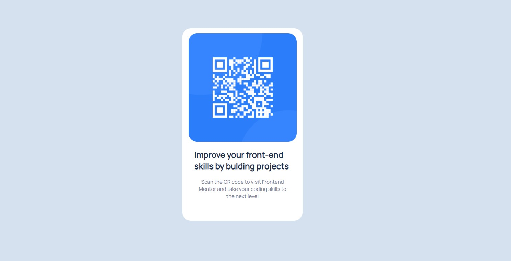

# Frontend Mentor - QR code component solution

This is a solution to the [QR code component challenge on Frontend Mentor](https://www.frontendmentor.io/challenges/qr-code-component-iux_sIO_H). Frontend Mentor challenges help you improve your coding skills by building realistic projects. 

## Table of contents

- [Overview](#overview)
  - [Screenshot](#screenshot)
  - [Links](#links)
- [My process](#my-process)
  - [Built with](#built-with)
  - [What I learned](#what-i-learned)
  - [Continued development](#continued-development)
- [Author](#author)

## Overview

I was challenged to create a QR Code card this is to help me improve my css and html

### Screenshot



### Links

- Solution URL: [Add solution URL here](https://your-solution-url.com)
- Live Site URL: [Add live site URL here](https://your-live-site-url.com)

## My process

I took the approach of using multiple divs, 1 for the card in order to create a card and two more one to contain an image and one to contain the contents of the card
i then used css to style them as close to the mockup as i could.

### Built with

- Semantic HTML5 markup
- CSS 
- CSS Grid
- Mobile-first workflow

### What I learned

Use this section to recap over some of your major learnings while working through this project. Writing these out and providing code samples of areas you want to highlight is a great way to reinforce your own knowledge.

Im quite happy that I learnt how to make a div center dependant on screen width see below 

```
.card {
    position: absolute;
    top: 0px;
    left: 0px;
    right: 0px;
    bottom: 0px;
    margin: auto;
}
```

### Continued development

I want to continue working on creating semantic html as i feel like it will help me grasp the idea of creating responsive websites as thats what I struggle with.

## Author

- Website - [michael surgeon](https://github.com/MichaelSurgeon)
- Frontend Mentor - [@MichaelSurgeon](https://www.frontendmentor.io/profile/MichaelSurgeon)
